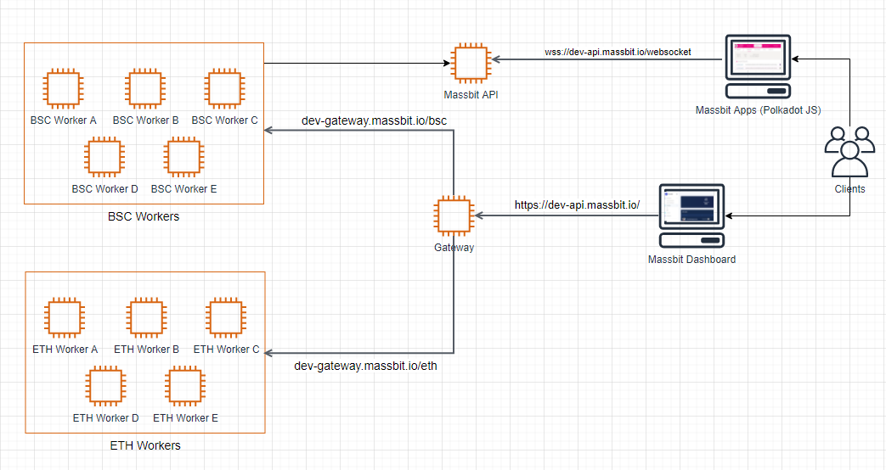

# Infra

## AWS / EC2 / BSC (Mainnet)
- We have 4 ways to start a fullnode:
    - fullnode-from-genesis: create from the start
    - fullnode-from-rsync: sync from an existing node
    - fullnode from-bsc-official-snapshot: use official snapshot from S3 or syncmode snap
    - fullnode-from-ebs-snapshot: mount existing data from a fullnode to another fullnode

- Progress:
    - fullnode-from-genesis : not tested
    - fullnode-from-rsync : not tested
    - fullnode from-bsc-official-snapshot : still in development
    - fullnode-from-ebs-snapshot : not tested

## AWS / EC2 / BSC (Testnet)
- To be updated

## AWS / EC2 / ETH
- To be updated

## AWS / EC2 / Massbit
